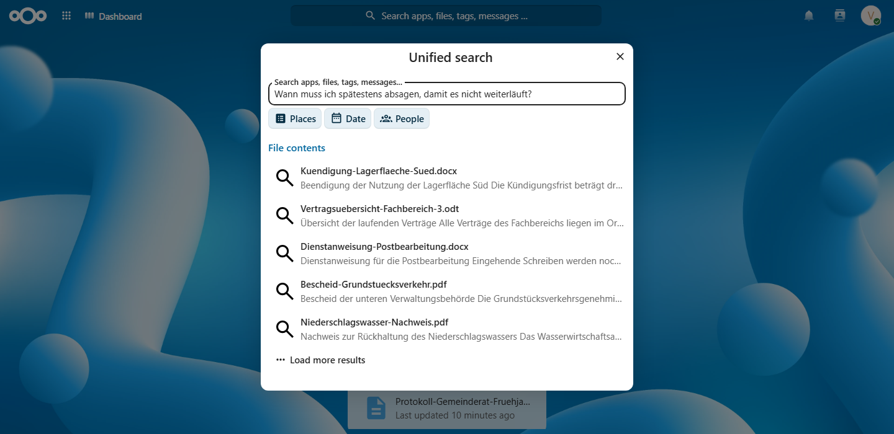

[Deutsch](README.md) | [English](README.en.md) | Français

# Findling

Recherche plein texte, reconnaissance optique et recherche sémantique pour
Nextcloud, sans configuration. Les résultats apparaissent dans la barre de
recherche normale.

**Findling + Nextcloud MCP Connector = la couche de récupération de votre propre RAG.**
Le [MCP Connector](https://apps.nextcloud.com/apps/mcp_connector) transmet les résultats de Findling à tout client MCP, avec
exactement les droits de l'utilisateur qui demande ; mesuré par le
[test de fidélité](https://github.com/street1983nk/nextcloud-mcp-connector/blob/main/tests/integration/test_content_hit_fidelity.py).
Le modèle, c'est vous qui l'apportez, et aucun contenu ne quitte votre serveur.

## Ce que Findling sait faire

- Recherche plein texte avec traitement des mots allemands : mots composés,
  flexion, trémas, phrases, exclusions, filtre par type de fichier
- Reconnaissance optique pour les PDF numérisés et les images : neuf langues
  disponibles (allemand, anglais, français, espagnol, italien, néerlandais,
  portugais, danois, estonien), allemand, anglais et français activés par
  défaut
- Recherche sémantique : trouve les documents par des périphrases
- Chaque résultat est vérifié par Nextcloud selon vos droits
- Aucune configuration : la première indexation démarre d'elle-même
- Profils de performance : Économe par défaut, Standard et Performance après
  une vérification préalable du matériel
- Modèle de recherche : int8 intégré, le fp32 plus précis se télécharge une
  fois sous Standard et Performance

## Types de fichiers pris en charge

PDF (numérisés aussi), DOCX, PPTX, XLSX, ODT, ODS, ODP, HTML, RTF, TXT,
Markdown, CSV, ainsi que les images (JPEG, PNG, TIFF, WebP) par
reconnaissance optique.

## Prérequis

- Nextcloud 33 à 35 avec l'application AppAPI (HaRP comme cible de
  déploiement)
- RAM : 4 Go suffisent. Sur une machine ARM64 de 4 Go avec 52 111 documents
  indexés et la recherche sémantique active, le conteneur a atteint un pic de
  1 764 Mo de mémoire anonyme résidente, sous une limite stricte de 2 Go imposée
  par le noyau.
- Après une indexation, le modèle déchargé, le conteneur reste à 730,2 Mo de
  mémoire résidente (mesuré le 26.09.2026 sur une machine m7g.large arm64 avec
  l'image v1.3, méthode et données brutes dans
  [docs/performance.md](docs/performance.md)).
- CPU : 2 cœurs suffisent, amd64 et arm64, pas de GPU
- Sans aucune intervention, Findling continue de fonctionner aussi sobrement
  qu'avant. Avec plus de matériel, un profil libère au plus la moitié de la
  machine (profil Standard) ou tout sauf un cœur (profil Performance).
- Les deux profils supplémentaires activent plusieurs emplacements OCR et une
  voie d'intégration parallèle, ce qui raccourcit l'indexation. Le changement se
  fait en un clic dans les paramètres d'administration sous Findling ; une
  suggestion adaptée à la machine est affichée à côté.

## Installation

Installer les deux entrées du store, toujours dans la même version :
[Findling](https://apps.nextcloud.com/apps/findling) (Apps) et
[Findling Backend](https://apps.nextcloud.com/apps/findling_backend)
(External Apps). La première indexation démarre ensuite d'elle-même ;
`occ findling:index --status` montre la progression. Avec beaucoup de
documents numérisés, la première indexation peut être longue (la
reconnaissance optique est coûteuse en calcul) ; les durées mesurées se
trouvent dans [docs/performance.md](docs/performance.md).

Si les deux applications tournent dans des versions majeures ou mineures
différentes, la recherche répond par rien plutôt que par des résultats
potentiellement faux, et la page d'administration affiche les deux numéros de
version.

## Architecture

Findling se compose de deux applications sous une même version :

- **findling** (section Apps du store) : l'application compagnon PHP
  enregistre le fournisseur de recherche dans la barre de recherche et
  vérifie chaque résultat contre les droits Nextcloud avant de l'afficher.
- **findling_backend** (section External Apps du store) : le conteneur fait
  le travail, extraction de texte, reconnaissance optique (Tesseract), index
  plein texte (Tantivy) et index sémantique (SQLite avec sqlite-vec). Il
  n'est joignable que par AppAPI/HaRP, et les routes qui renvoient du contenu
  ne sont pas joignables depuis le navigateur.

L'index vit dans le volume de l'application sur votre serveur ; il n'y a
aucun service intermédiaire et rien ne quitte l'instance.

## Confidentialité

Tout fonctionne localement dans le conteneur, aucune télémétrie, les fichiers
ne sont jamais modifiés. Ce qui est conservé, c'est le texte extrait, dans la
zone de données propre à l'application backend : une sauvegarde de cette zone
le contient, et l'index n'est pas chiffré au repos. Les remèdes, chiffrement
du disque de l'hôte et politique de sauvegarde réfléchie, sont expliqués avec
leurs raisons dans [docs/privacy.md](docs/privacy.md) (en allemand).

## Mesures

Chaque chiffre (mémoire, durées, charge de recherche, tests de panne, qualité
du modèle) est documenté avec sa méthode et ses données brutes dans
[docs/performance.md](docs/performance.md) et
[docs/embeddings.md](docs/embeddings.md).

## Entreprise

Findling est et reste sous AGPL. Des modules complémentaires payants et un
support avec des délais de réponse convenus sont prévus, mais ne sont pas
encore disponibles.

Demande de devis : admin@infranode.dev

## Licence

AGPL-3.0-or-later. Voir [LICENSE](LICENSE).
